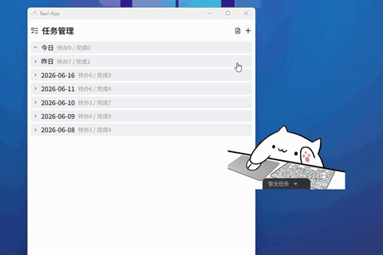
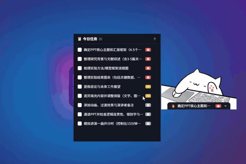

# 🚀 MeowToDo — AI 驱动的桌面效率桌宠 — 任务拆解 · 情感陪伴 · 智能日报

[//]: # "forked from ayangweb/BongoCat — added full AI task management suite"

> 一款融合了"情感陪伴 + 智能全栈任务管理"的桌面宠物。通过 AI 能力彻底打通【任务拆解 → 行为驱动 → 自动日报】的生产力闭环。  
> 基于 [BongoCat](https://github.com/ayangweb/BongoCat) 桌宠框架二次开发，新增完整的 AI 任务管理与效率系统。

---

## 📺 核心功能动感演示（Demo）

| 🧠 AI 任务智能拆解 | 🦊 拟人化桌宠交互 | 📊 一键 AI 日报 |
| :---: | :---: | :---: |
|  |  |  |

---

## 🌟 核心功能与 AI 落地场景

### 1. 🧠 AI 任务智能拆解（Agent 拆解层）

- **用户痛点**：面对复杂任务（如"写论文"）无从下手，导致拖延。
- **产品解法**：调用 LLM（支持 OpenAI / DeepSeek / Gemini）构建 Task Agent。用户输入一句话目标，AI 自动将其结构化拆解为可执行的子任务，并支持以下能力：
  - ✅ 智能拆解：一句话 → N 个带优先级的子任务
  - ✅ 子任务编辑：在 AI 结果基础上增删改，灵活调整
  - ✅ 批量创建：一键将所有子任务加入 TODO List

### 2. 🦊 情感化桌面宠物（用户黏性层）

- **产品解法**：基于 Live2D 桌宠框架二次开发。桌宠实时响应键盘、鼠标、手柄操作并同步动作，支持：
  - ✅ 自定义 Live2D 模型导入
  - ✅ 任务完成时随机弹出鼓励/庆祝提示
  - ✅ 窗口穿透、置顶、透明度、缩放等自由定制
  - ✅ 跨平台支持（macOS / Windows / Linux）

### 3. 📊 一键 AI 日报生成（价值交付层）

- **产品解法**：自动捕获用户当日完成的 TODO 数据，通过 LLM 自动提炼、润色，一键生成结构化、职场范的工作日报，支持：
  - ✅ AI 自动生成：基于今日完成的任务智能撰写
  - ✅ 历史日报管理：分页浏览、按日期/关键词搜索
  - ✅ Markdown 富文本预览
  - ✅ 日完成度可视化看板（数据面板）

---

## 🛠️ 技术栈与实现路径

| 层级 | 技术选型 |
| :--- | :--- |
| **桌面框架** | [Tauri 2](https://v2.tauri.app/) — Rust 后端 + WebView 前端 |
| **前端框架** | Vue 3 + TypeScript + Pinia 状态管理 |
| **UI 组件** | Ant Design Vue Next + UnoCSS 原子化样式 |
| **桌宠引擎** | Live2D + Pixi.js 8（easy-live2d） |
| **AI 集成** | OpenAI API 兼容（支持 OpenAI / DeepSeek / Gemini） |
| **数据存储** | SQLite（sqlite，本地离线，无云同步） |
| **跨平台** | macOS / Windows / Linux |
| **开发模式** | Vibecoding（Prompt-Driven Development）— 借助 AI 编程助手快速原型构建与迭代 |

---

## 🚀 快速开始

### 本地开发

# 1. 安装依赖
pnpm install

# 2. 启动开发模式
pnpm tauri dev

# 3. 构建
pnpm tauri build

### AI 配置

在设置页面配置 AI Provider（支持 OpenAI、DeepSeek、Gemini），填入 API Key 和 Base URL 即可使用任务拆解和日报生成功能。

---

## 🤝 贡献

欢迎提交 Issue 和 PR！请遵循常规的 GitHub 贡献流程。

---

## 📄 License

本项目基于 [BongoCat](https://github.com/ayangweb/BongoCat) 进行二次开发，遵循原项目开源协议。

See [LICENSE](./LICENSE).
